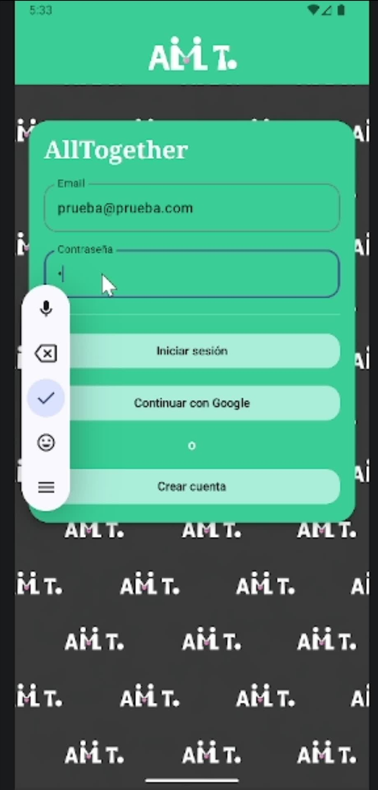
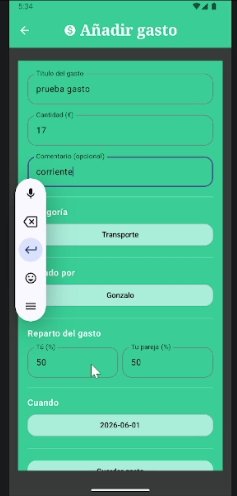
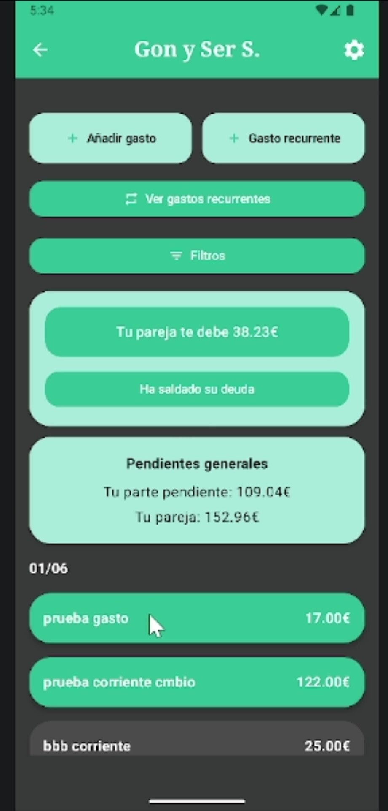
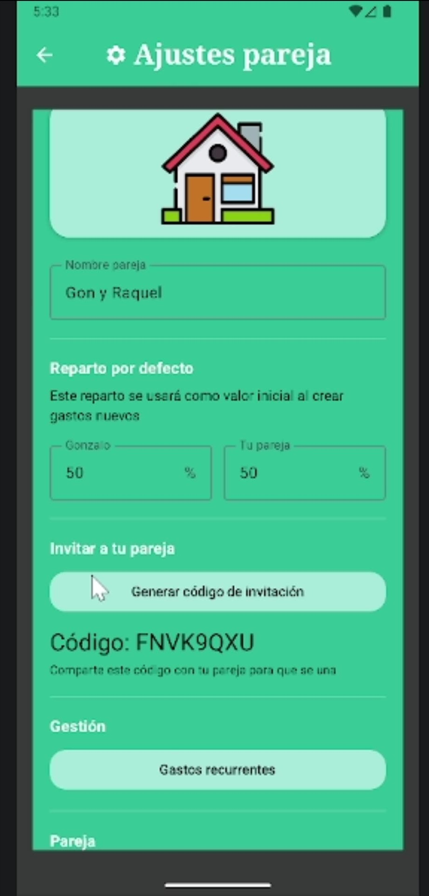

# AllTogether

Gestión de gastos compartidos para parejas: quién ha pagado, cómo se reparte y quién debe a quién. Proyecto Intermodular, 2º de DAM.

Equipo: [Gonzalo Sebastián](https://github.com/gonzalo9597) · [Sergio Malón](https://github.com/malonsergio) · [Sergio Sanz](https://github.com/Truffas) 

## Capturas

<table>
<tr>
<td></td>
<td></td>
<td></td>
<td></td>
</tr>
</table>

(El backend en AWS ya no está activo, lo dimos de baja al terminar la evaluación para no seguir pagando RDS/Lambda. Estas capturas son de la app funcionando el día de la presentación.)

## Qué hace

Nuestro referente al empezar fue Tricount, pero está pensado para repartir un gasto puntual entre un grupo (una cena, un viaje), no para llevar el día a día de dos personas que comparten gastos de forma continua: pareja, gente que vive junta, padres separados con hijos en común. AllTogether va de eso.

- Crear pareja o unirte con un código de invitación
- Añadir gastos, fijos o recurrentes, y repartirlos a medias, por porcentaje o por importe fijo
- Dashboard con el balance: quién debe a quién
- Notificación cuando tu pareja añade o salda un gasto
- Filtros por fecha, categoría o estado

## Cómo está montado

Backend serverless en AWS. La app (Kotlin + Jetpack Compose) llama a una API Gateway, que dispara funciones Lambda en Python (una por cada acción: login, guardarGasto, getBalance...) y estas leen y escriben en MySQL sobre RDS. Los gastos recurrentes los genera una regla de EventBridge que corre cada mañana. Las notificaciones van por Firebase.

```
App Android (Kotlin, Jetpack Compose, Ktor)
   → API Gateway
   → Lambdas en Python (~20 funciones)
   → RDS MySQL / Firebase
```

## Pruebas

42 tests unitarios con JUnit y probamos la app con 4 personas ajenas al grupo. Nos dijeron que el dashboard cargaba demasiada info de golpe y que los gastos recurrentes quedaban escondidos dentro de ajustes.

Lo más interesante fue la prueba de carga con Artillery. Al principio la app fallaba muchísimo con tráfico simultáneo (10,7% de peticiones exitosas) y no era un bug nuestro: la cuenta gratuita de AWS solo deja 10 ejecuciones de Lambda a la vez. Pedimos a AWS que lo subiera a 100 y la tasa de éxito subió a 65,9%, sin errores 500 ni timeouts.

## Stack

Kotlin · Jetpack Compose · Ktor · Python (AWS Lambda) · API Gateway · MySQL (RDS) · EventBridge · Firebase Cloud Messaging

## Equipo

Fuimos tres y no nos repartimos por capas fijas: los tres tocamos en algún momento el Kotlin, las Lambdas y la base de datos.
